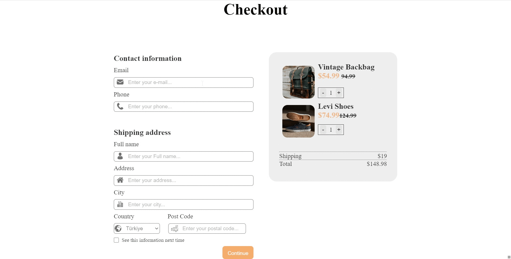

# Checkout Form 

Purpose of the this project is to write a code that make a checkout form.

## Outcomes

👨‍💻 The main aim of this project are as follows; 

- analyze a problem, identify and apply programming knowledge for appropriate solution.

- demonstrate their knowledge of algorithmic design principles by using function effectively.

   
## Problem Statement

- Write a code that creates a checkout form.

- Create a checkout page following the design.

* Functionally similar to this: [Form](https://aaron-clarusway.github.io/form/)

 

-  User story;

   - I can input email, phone, full name, address, city, country, and postal code

   - I can select at least 3 countries from the dropdown

   - When I click submit button or press enter, I can see a warning if validation fails

   - When I click submit button or press enter, I can see a successful alert if validation succeeds

 ⌛ Happy Coding  ✍ 

br> 
🌐 The desktop version of the web page is as follows;🧭
  

## 🖥️Desktop version
 

 
 
 
 
 
 
 
 
 
         