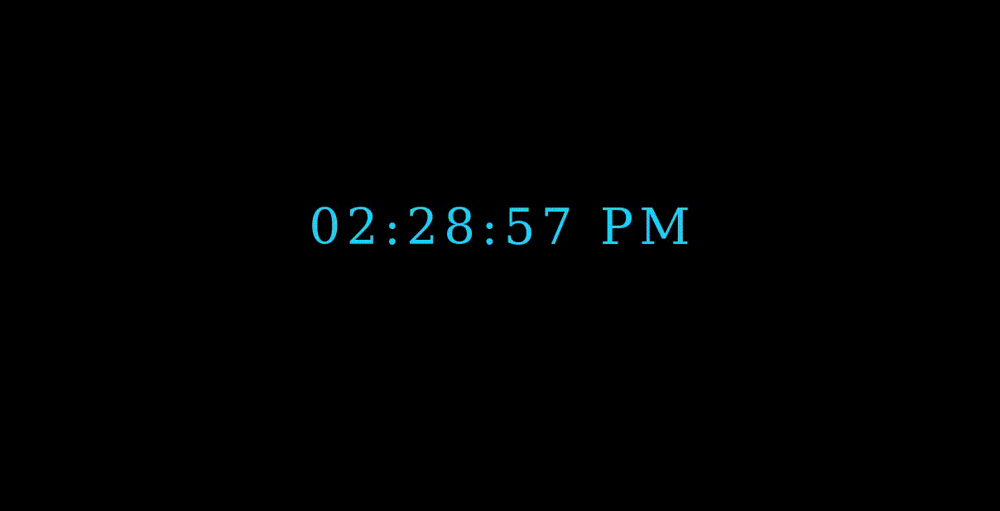

# Digital Clock 

## Description
Project aims to create a digital clock.

## Project Skeleton 

```
005-Digital-Clock(folder)
|
|----readme.md         
        |----index.html  
        |----style.css   
        |----app.js
```

## Expected Outcome



## Objective

Build a Digital Clock web site 

### At the end of the project, following topics are to be covered;

- HTML 

- CSS

- JS


### At the end of the project, students will be able to;

- improve coding skills within HTML & CSS & JS

- use git commands (push, pull, commit, add etc.) and Github as Version Control System.

🔗 To see live version 🎯https://tal58.github.io/API_WORKSHOP/World_flags_memory_competition/

<p align='center'> ⌛ Happy Coding  ✍ </p>

