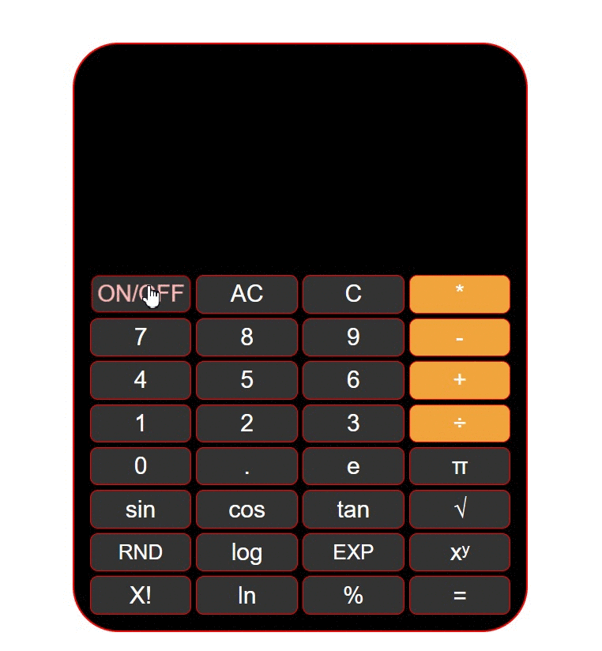

# IOS CALCULATOR

## Description
👨‍💻 Project aims to create a calculator app and also  improve my <b>HTML/CSS/JS skills and ©️cloning abilities</b>.

## Problem Statement

- Your company has recently started on a project that aims to create a calculator. So you and your colleagues have started to work on the project. Instead of this duty, I additionally add extra properties to my calculator.
<br>
- Challenge is to build out this landing page and get it looking as close to the professional design as possible...🎯 

## Project Skeleton 

```
003-calculator(folder)
|
|----readme.md                 
|----solution
        |----index.html  
        |----style.css   
        |----index.js
```

## Expected Outcome


## Objective

Build a Calculator that is functionally similar to an ios device calculator.

### At the end of the project, following topics are to be covered;

- HTML 

- CSS

- JS
<br>
🔗 To see live version 🎯https://tal58.github.io/JavaScript_DOM_Manipulations/Ios-Calculator/

<p align="center"> ✍ Happy Coding ⌛ <p>


##  🖥️Desktop version



