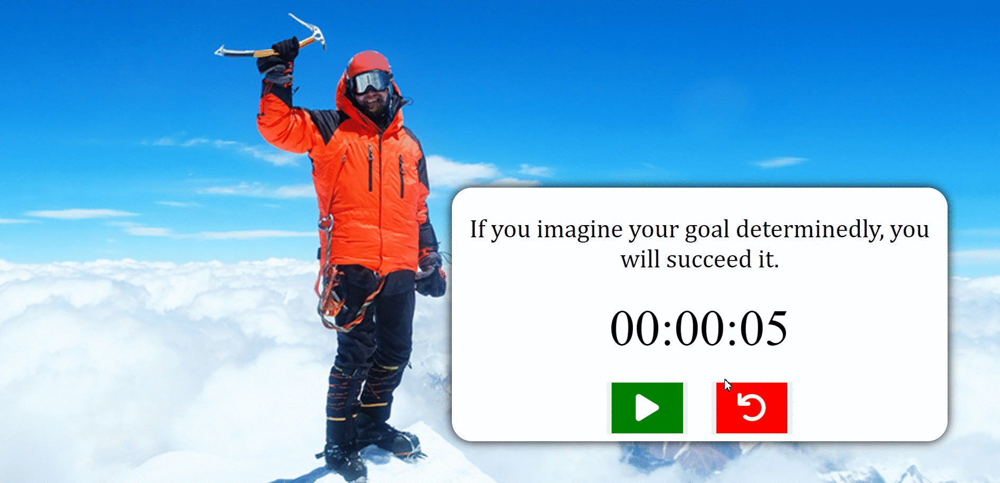

## JavaScript DOM Manipulations | Stop-Watch 🕰️

👨‍💻 This project aims to improve my <b>HTML/CSS/JavaScript and DOM skills </b> 
  
🎯 This project shows how to build an interactive landing page that timer start/stop/reset when click on the play/stop and reset buttton...

🔗 To see live version 🎯https://tal58.github.io/JavaScript_DOM_Manipulations/Stop-Watch/
 

 ⌛ Happy Coding  ✍ 

  
🌐 The desktop and mobile versions of the web page are as follows;🧭
  

## 🖥️Desktop version
 

 
 
 
 
 
 
 
 
 
 
 
 
 
 
 
 
 

## 📱Mobile version
 

