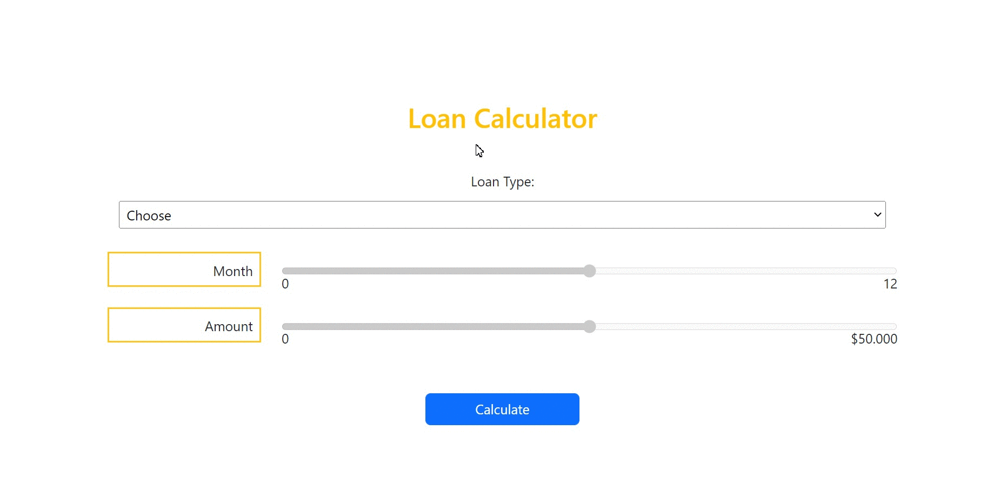
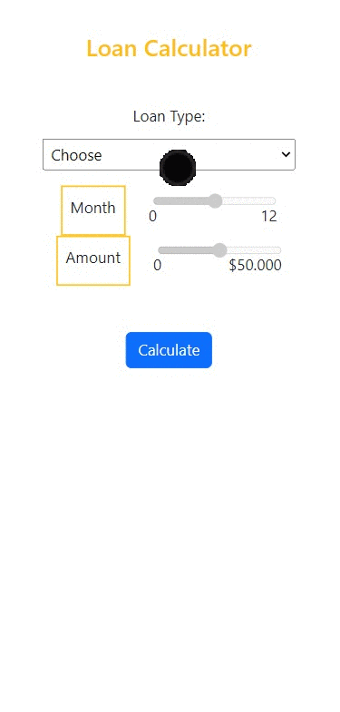

# DOM Manipulations  

Purpose of the this project is to write a code that make a loan calculator web page.

## Outcomes

👨‍💻 The main aim of this project are as follows; 

- improve my <b>HTML/CSS/JavaScript and DOM skills </b> 

- analyze a problem, identify and apply programming knowledge for appropriate solution.

- demonstrate their knowledge of algorithmic design principles by using function effectively.

🔗 To see live version 🎯https://tal58.github.io/JavaScript_DOM_Manipulations/bank_loan/

 ⌛ Happy Coding  ✍ 

  
🌐 The desktop version of the web page is as follows;🧭
  

## 🖥️Desktop version
 

 
 
 
 
 
 
 
 
 
         

## 	📱Desktop version 
 

 
 
 
 
 
 
 
 
 
         
