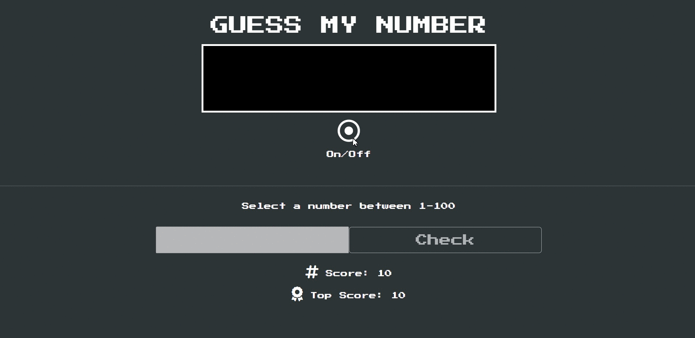

# Guess My Number -With async function 🤔

👨‍💻 This project aims to make a game by using HTML/CSS/JavaScript.

## Learning Outcomes

🎯 The main aim of this project are as follows; 

- To understand an async function which is a function declared with the async keyword, and the await keyword is permitted within it. The async and await keywords enable asynchronous, promise-based behavior to be written in a cleaner style, avoiding the need to explicitly configure promise chains.

- analyze a problem, identify and apply programming knowledge for appropriate solution.

- demonstrate their knowledge of algorithmic design principles by using function effectively.

- improve HTML/CSS/JavaScript abilities.

🔗 To see live version 🎯https://tal58.github.io/JavaScript_DOM_Manipulations/guess_number_game/
   

 ⌛ Happy Coding  ✠

🌐 The desktop version of the web page is as follows;🧭
  

## 🖥️Desktop version
 

 
 
 
 
 
 
 
 
 
         

