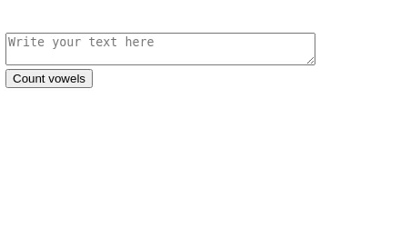
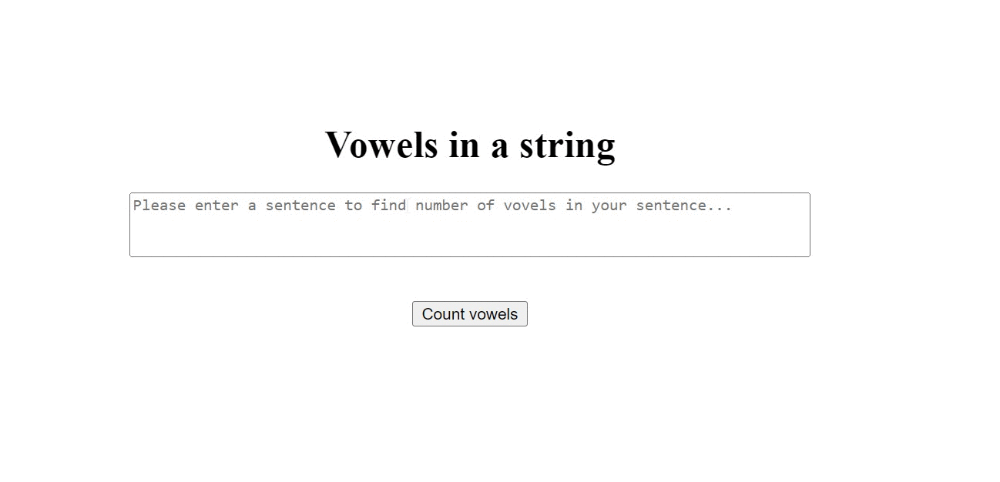

# Vowels in a string

This challenge is to return an integer of the number of vowels found in a string.

## Expected Outcome

## Learning Outcomes

At the end of the this coding challenge, you will be able to;

- Analyze a problem, identify and apply programming knowledge for appropriate solution.

- Demonstrate their knowledge of algorithmic design principles by using JavaScript effectively.

## Problem Statement

- Take a string from user.
- Calculate the number of vowels and present them on the page.

 ⌛ Happy Coding  ✍ 

  
🌐 The desktop version of the web page is as follows;🧭
  

## 🖥️Desktop version
 

 
 
 
 
 
 
 
 
 
         
